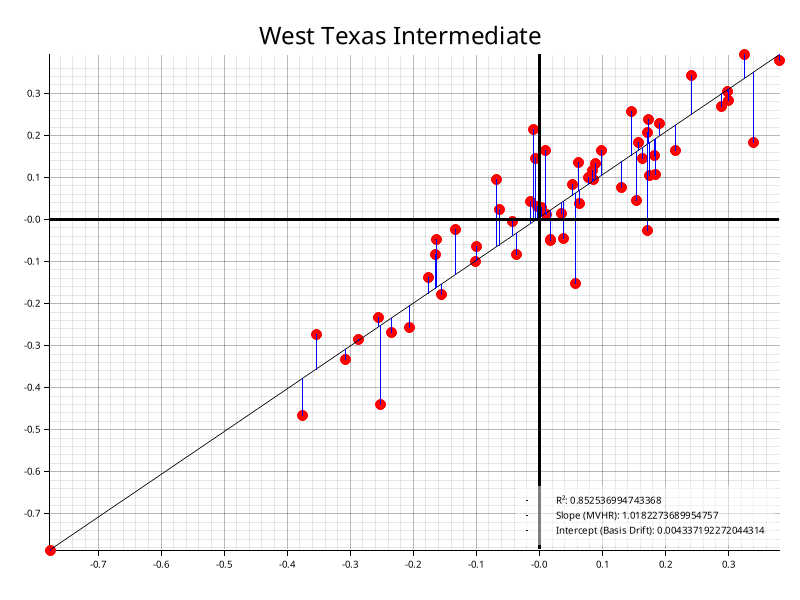
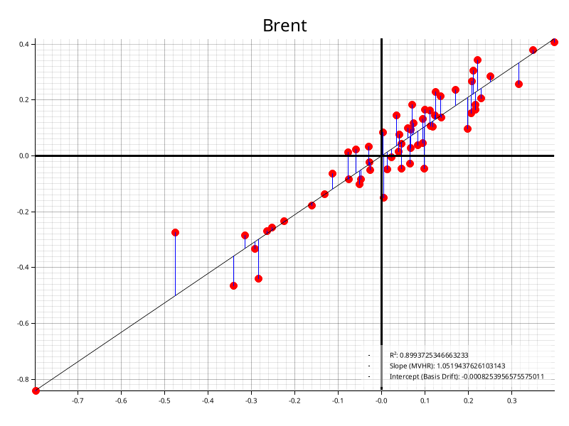
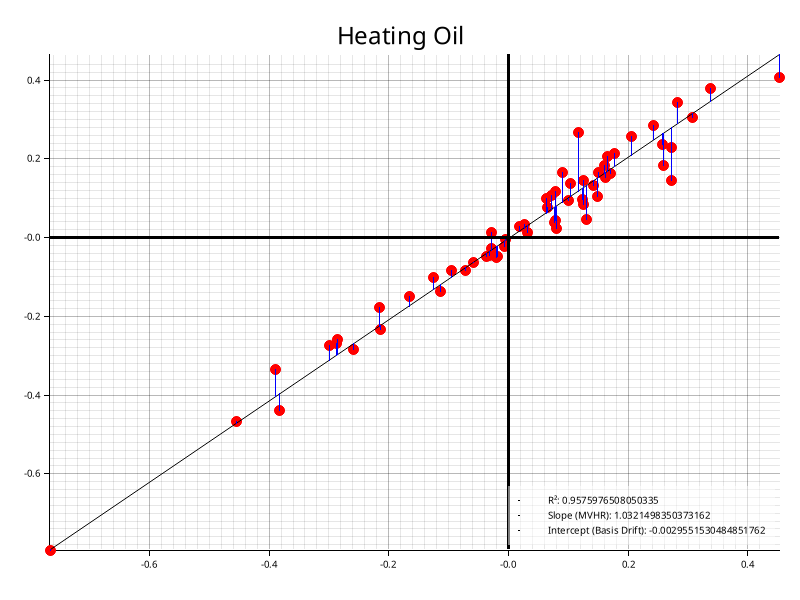
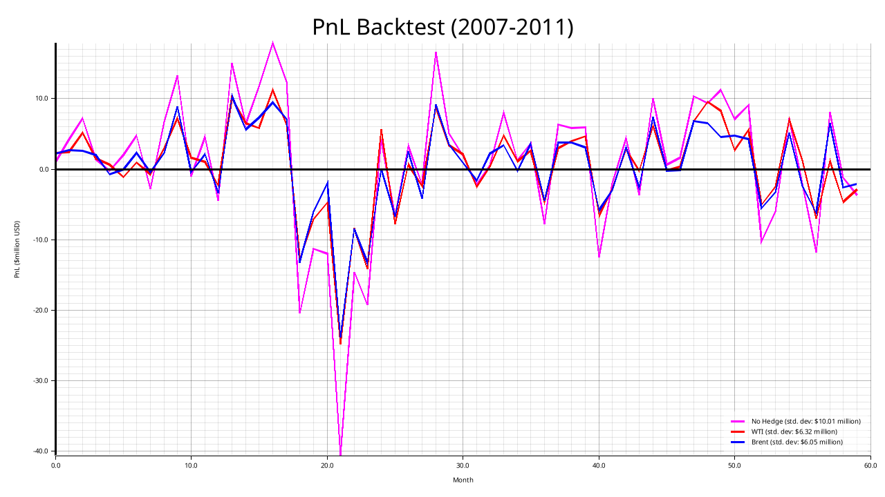

# Linear Regression and PnL Backtesting in Rust 

This was created for an assessment looking at oil derivative hedges against jet fuel price fluctuations.

The data in `./data` contain monthly spot price changes for various oil products, normalised to gallon units. For simplicity and due to a lack of data in the original case study we assume the spot prices are reflective of the futures price.

The case study is not present here because I do not have permission to upload it publicly, but it's a JetBlue airways case study from the University of Virginia, discussing the divergence of Brent and WTI prices in 2011 due to the glut in Cushing, OK.

## Implementation details

This project implements linear regression using the normal equation and ordinary least squares method. It uses only the following external libraries:

* `serde` and `csv` to parse the CSV files
* `plotters` to create the visualisations
* `approx` for assertions against floats

All of the mathematics and actual logic is performed by hand. 

Generative AI was ***NOT*** used in this project (beyond the unavoidable AI answers you get now when you google things).

### But why?

Rust isn't necessarily the perfect choice for this use case - I could have used Excel or simply done a small Python script or Jupyter notebook where I import pandas/numpy and do the regression in a few lines of code. 

However, I wanted to take this opportunity to build both my practical experience with Rust and my understanding of the underlying maths that goes into linear regression. I recently took linear algebra and wanted to put that theoretical knowledge into practical use.

### Future Improvements

Here's my roadmap in a perfect world where I have time to perfect this project:

* A more complete unit test suite. I've written a few tests validating some of the mathematical functions, but I'd prefer more test coverage. I also didn't want to just add AI slop tests; I'm trying to actually learn something here.
* Genericize - I'd like to be able to pass in the input data files or something similar so that this can be re-used for other applications easily.
* Performance optimizations - I'm using `Vec<f64>` all over the place here, where a stack-based data structure would be more ideal in some instances. There is definitely some room to improve in this regard.
* Modules - All of the code is within a single main.rs file, and it's somewhat messy. This needs to be split up for cleanliness.

## How to use

* [Install `cargo` and `rust`](https://doc.rust-lang.org/cargo/getting-started/installation.html)
* Clone this repository
* Open the repository folder in a terminal and run `cargo run`.
* If you want the compiled version with optimisations: `cargo build --release && cargo run --release`. I can't guaruntee this will work on Windows or MacOS, it has only been tested on Ubuntu.


## Output

Expected CLI output is like so:

```
-------------------REGRESSION-------------------


Running regression for brent

R^2 = 0.8993725346663233, Intercept = -0.0008253956575575011, MVHR = 1.0519437626103143
Intercept (basis drift) statistically insignificant (T-stat: 0.08691309500064658)
Slope (MVHR) statistically significant (T-stat: 22.76803447848532)

Running regression for wti

R^2 = 0.852536994743368, Intercept = 0.004337192272044314, MVHR = 1.0182273689954757
Intercept (basis drift) statistically insignificant (T-stat: 0.3779632356212812)
Slope (MVHR) statistically significant (T-stat: 18.311717233347107)

Running regression for heating_oil

R^2 = 0.9575976508050335, Intercept = -0.0029551530484851762, MVHR = 1.0321498350373162
Intercept (basis drift) statistically insignificant (T-stat: 0.47905395635930587)
Slope (MVHR) statistically significant (T-stat: 36.19183253030201)

-------------------BACKTESTS-------------------

-------No hedge-------
Max. drawdown: -$120.53 million
Max. monthly loss: -$40.60 million
Std. dev (volatility): $10.01 million
MVHR: 1.00 (N/A)
Num. contracts: 0
---------WTI----------
Max. drawdown: -$75.80 million
Max. monthly loss: -$24.79 million
Std. dev (volatility): $6.32 million
MVHR: 1.02
Num. contracts: 485
--------Brent---------
Max. drawdown: -$75.12 million
Max. monthly loss: -$23.81 million
Std. dev (volatility): $6.05 million
MVHR: 1.05
Num. contracts: 501

-----------------------------------------------
```

### Regression Results





### Backtest Results

